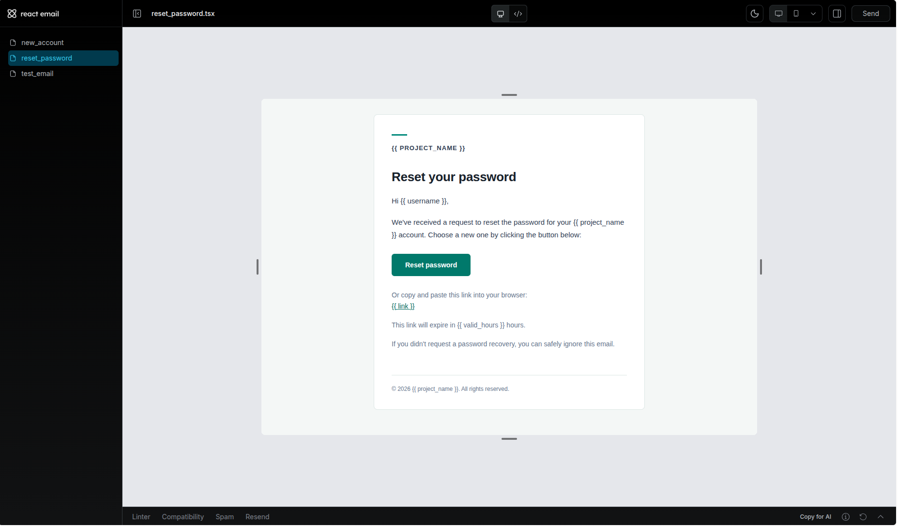

# Full Stack FastAPI Template

## Technology Stack and Features

- ⚡ [**FastAPI**](https://fastapi.tiangolo.com) for the Python backend API.
  - 🧰 [SQLModel](https://sqlmodel.tiangolo.com) for the Python SQL database interactions (ORM).
  - 🔍 [Pydantic](https://docs.pydantic.dev), used by FastAPI, for the data validation and settings management.
  - 💾 [PostgreSQL](https://www.postgresql.org) as the SQL database.
- ✅ Tests with [Pytest](https://pytest.org).
- 🏭 CI (continuous integration) based on GitHub Actions.
- ☁️ [FastAPI Cloud](https://fastapicloud.com) for deployment.
- 🐋 [Docker Compose](https://www.docker.com) for local services and self-hosted deployment.
  - 📞 [Traefik](https://traefik.io) as a reverse proxy with automatic HTTPS.
- 🔒 Secure password hashing by default.
- 🔑 JWT (JSON Web Token) authentication.
- 📫 Email-based password recovery.
- ✉️ [React Email](https://react.email) for email templates.
- 📬 [Mailpit](https://mailpit.axllent.org) for local email testing during development.
- ✅ Tests with [Pytest](https://pytest.org).
- 🏭 CI (continuous integration) and CD (continuous deployment) based on GitHub Actions.

### React Email Templates

### Mailpit - Local Email Testing

### API Documentation

## How to Use It

Click the **Use this template** button at the top of this page to create a new repository.

## Backend Development

Backend docs: [backend/README.md](./backend/README.md).

## Deployment

FastAPI Cloud deployment: [deployment.md](./deployment.md).

Self-hosted deployment with Docker Compose: [deployment-docker-compose.md](./deployment-docker-compose.md).

## Development

General development docs: [development.md](./development.md).

This includes the local FastAPI workflow, Docker Compose services, `.env` configuration, and more.

## Release Notes

Check the file [release-notes.md](./release-notes.md).

## License

The Full Stack FastAPI Template is licensed under the terms of the MIT license.
